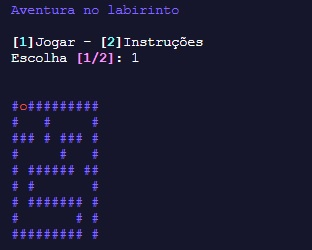
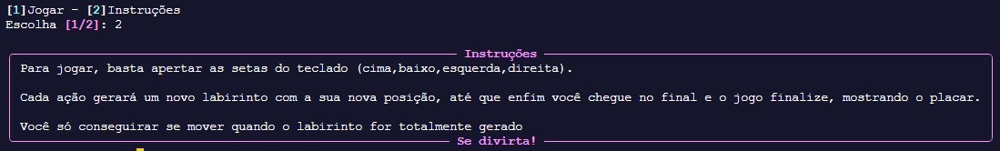

# Aventura no Labirinto



## Descrição

**Aventura no Labirinto** é um jogo interativo no terminal onde o jogador deve encontrar a saída de um labirinto, utilizando as setas do teclado para se mover. O jogo permite escolher entre diferentes níveis de dificuldade e personalizar as cores do labirinto. Também há uma opção para ativar música ambiente durante o jogo.

## Funcionalidades

- Escolha de dificuldade (fácil, médio, difícil).
- Movimentação do jogador utilizando o teclado (setas direcionais).
- Exibição colorida do labirinto e do jogador.
- Música de fundo opcional.
- Tela inicial e final com mensagens personalizadas.

## Como executar o projeto

1. Clone este repositório:
    ```bash
        git clone

2. Navegue até o diretório do jogo.

3. Crie um ambiente virtual:
   ```bash
   python3 -m venv venv

4. Ative o ambiente(linux):
    ```bash
    source venv/bin/activate

5. Ative o ambiente(windows):
    ```bash
    ./venv/Scripts/activate
    
6. Instale as dependências:
    ```bash
     pip install -r requirements.txt

7. Execute o projeto no modo help para ver os parâmetros disponíveis:
   ```bash
   python main.py -h

## Como jogar

1. Agora você pode só executar o projeto real com os parâmetros vistos no help:
    ```bash
    python main.py --parâmetro1 [argumento] --parâmetro2 [argumento]...

2. Então você verá o menu incial:
    

    Você pode escolher 2 para ver as instruções do jogo ou ir logo para o jogo escolhendo 1

3. No labirinto:
   - 
   - você usará as setas do teclado para se locomover.
   - Cada ação imprimirá um novo labirinto, e você só conseguirá se mover após o print estar completo.
   - caso queira parar o jogo, basta apertar ESC
   - Ao chegar na saída, exibirá tela de vitória
   - Não há derrotas, apenas desistência
